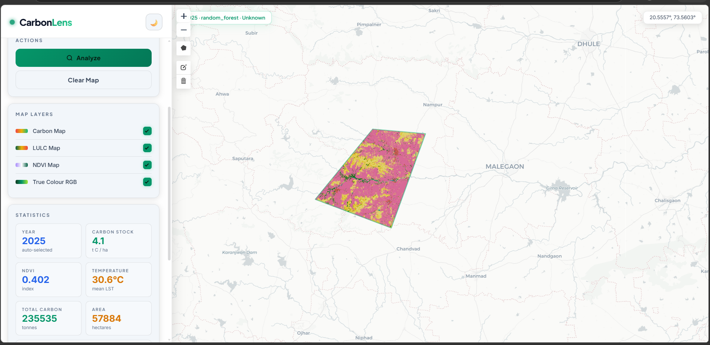
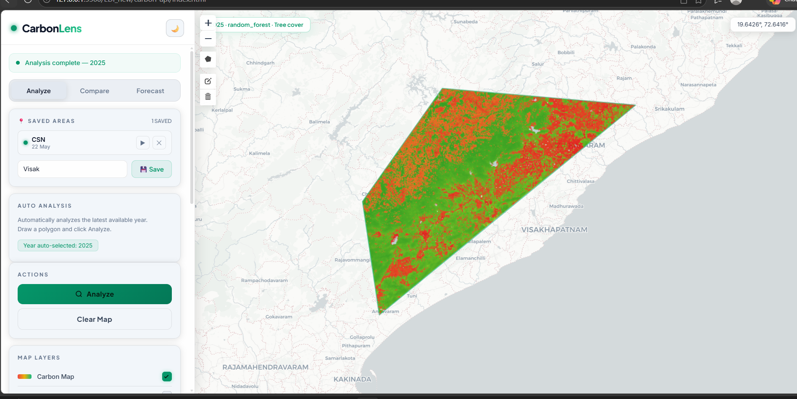
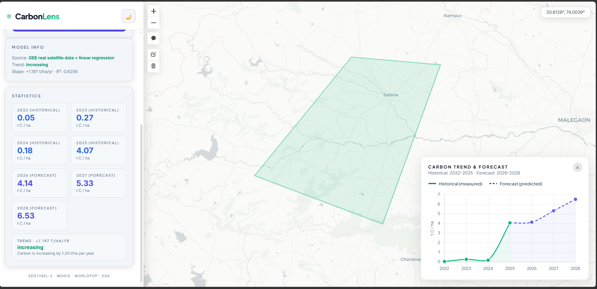

# 🌍 CarbonLens

**Geospatial carbon footprint mapping powered by satellite data and machine learning.**

CarbonLens lets you draw any area on a map and instantly analyze its carbon stock using real satellite data — no ground surveys, no manual data collection. Built as a deep-dive into Google Earth Engine, remote sensing datasets, and applied ML for an Entrepreneurship Development and Innovation (EDI) project.



---

## ✨ Features

- **Draw & Analyze** — draw a polygon anywhere on the map and get instant carbon stock predictions
- **Multiple map layers** — Carbon Map, Land Use/Land Cover (LULC), NDVI, and True Colour RGB overlays
- **Compare mode** — compare carbon stock between any two years for the same area, with a gain/loss visualization
- **Forecast mode** — projects future carbon trends (2026–2028) using linear regression on historical satellite data, with trend slope and R² reported
- **Saved areas** — save and revisit specific regions of interest
- **Real-time statistics** — carbon stock (t C/ha), NDVI index, mean land surface temperature, and total area, all computed on demand

## 🛰️ How it works

CarbonLens pulls real satellite imagery and derived datasets from **Google Earth Engine**, including:

- **Sentinel-2** — high-resolution optical imagery for vegetation and land cover analysis
- **ESA WorldCover** — global land cover classification
- **MODIS** — land surface temperature data
- **WorldPop** — population density context

A **Random Forest regression model** (scikit-learn) is trained on these features to predict carbon stock (t C/ha) for any drawn area. For the Forecast mode, a linear regression is fit over historical yearly estimates to project future trends.

## 🖥️ Screenshots

| Analyze | Compare |
|---|---|
|  |  |

| Forecast & Trend |
|---|
|  |

## 🧰 Tech Stack

**Backend:** FastAPI, Python, scikit-learn (Random Forest), Google Earth Engine Python API
**Frontend:** Leaflet.js, vanilla JS/HTML/CSS
**Data:** Sentinel-2, ESA WorldCover, MODIS, WorldPop (via GEE)

## 🚀 Getting Started

### Prerequisites
- Python 3.9+
- A [Google Earth Engine](https://earthengine.google.com/) account and service account credentials

### Setup

```bash
# Clone the repo
git clone https://github.com/NirbhayChukekar/carbon-footprint-mapping.git
cd carbon-footprint-mapping

# Install dependencies
pip install -r requirements.txt
```

### Google Earth Engine credentials

This project needs your own GEE service account to fetch satellite data:

1. [Sign up for Earth Engine](https://signup.earthengine.google.com/#!/service_accounts) and create a service account
2. Download the service account JSON key
3. Place it at `credentials/service_account.json`
4. Copy `.env.example` to `.env` and fill in your `GEE_SERVICE_ACCOUNT_EMAIL` and `GEE_PROJECT_ID`

### Run

```bash
python run.py
```

Then open `index.html` in your browser (or navigate to `http://localhost:8000`).

## 📊 Model Info

The carbon prediction model is a Random Forest Regressor trained on satellite-derived features (NDVI, land cover class, temperature, and more). The forecast trend uses linear regression on historical yearly carbon estimates, reporting slope (t/ha/yr) and R² for transparency.

## 📝 Notes

This project was built as a learning-focused deep dive into geospatial ML — covering GEE authentication, remote sensing datasets (Sentinel-2, ESA WorldCover, MODIS, WorldPop), vegetation indices (NDVI), and regression modeling end-to-end.

## 📄 License

MIT
